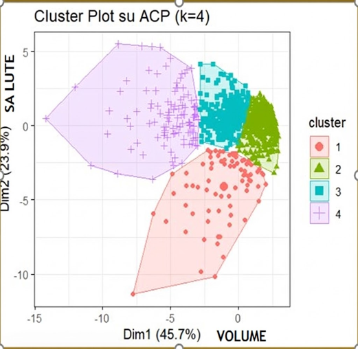

# Italian-Startup-Analysis
Multivariate Statistical Analysis of 900+ companies using PCA and K-Means Clustering in R.
# Italian Startup Ecosystem - Multivariate Analysis 🇮🇹

## 📌 Project Overview
An advanced statistical analysis of **963 Italian Innovative Startups** to identify performance patterns and risk profiles.
Using **R**, I processed financial datasets (AIDA) to segment the market based on structural dimensions (Revenue, Employees) and health indicators (EBITDA, ROI, Equity).

**Tech Stack:** R, Tidyverse, FactoMineR, ggplot2.

## 📊 Methodology
The analysis followed a rigorous statistical pipeline:
1.  **Data Preprocessing:** Standardization (Z-Score) to handle heterogeneous variables [Revenue vs Ratios].
2.  **Suitability Checks:** Validated through **KMO Test (0.71)** and **Bartlett's Test of Sphericity** (p-value < 0.001).
3.  **Dimensionality Reduction (PCA):**
    - Reduced 15 variables into **2 Principal Components** explaining **69% of variance**.
    - *PC1 (Volume):* Correlated with Revenue, Employees, Total Assets.
    - *PC2 (Health/Profitability):* Correlated with EBITDA, Net Income, ROE.
4.  **Clustering (K-Means):**
    - Optimal number of clusters **(k=4)** determined via **Elbow Method**.
    - Validation via **ANOVA** (F-test significant for all variables).

## 💡 Key Insights (The 4 Strategic Clusters)
The K-Means algorithm identified 4 distinct corporate profiles:

| Cluster | Profile Name | Characteristics | Risk Status |
| :--- | :--- | :--- | :--- |
| **1 (Purple)** | **Top Performers** | High Volume, High Profitability. Market Leaders. | 🟢 Excellent |
| **2 (Blue)** | **Solid SMEs** | Medium dimensions, positive health metrics. Stability buffer. | 🟢 Low Risk |
| **3 (Green)** | **Micro-Enterprises** | Small scale, neutral health. Low variability. | 🟠 Medium Risk |
| **4 (Red)** | **Giants in Crisis** | Large dimensions but negative profitability. Destroying value. | 🔴 High Risk |

## 📈 Visualizations

*Figure 1: K-Means Cluster visualization on the first two Principal Components.*

## 👨‍💻 Authors
- **Giulio Augugliaro** - *Statistical Modeling & R Programming*
